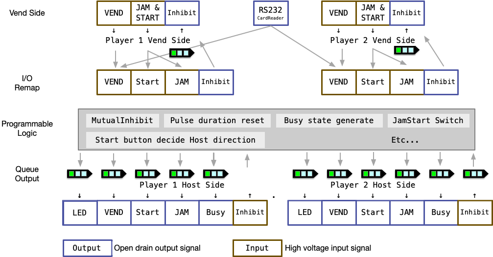

<!--
SPDX-FileCopyrightText: © 2023 Jinwoo Park (pmnxis@gmail.com)

SPDX-License-Identifier: MIT OR Apache-2.0
-->

# 프로그램 로직

간략화된 프로그램 및 시그널 입출력 플로우는 아래와 같습니다.  

## 대략적인 동작 개요

화폐지불장치(카드 승인기, 코인기, 지폐기 등)을 GAME I/O PCB 에 연결하기 전에 입출력 신호를 기억, 변조, 지연 등을 하여 지불시스템을 개선하는 장치입니다.

DIP Switch 설정과 적절한 배선 변경을 통하여 원하는 화폐지불장치와 GAME I/O PCB 간의 설정을 유도할 수 있습니다.

이 장치를 통해서 이와 같은 설정을 할 수 있습니다.

- 기존 게임기에 카드 승인기 설치
- 기존 게임기에 카드 승인기 와 지폐기(코인기) 를 동시에 1P에 사용
- 기존 게임기에 1대의 카드 승인기 와 1대의 지폐기(코인기)로 스타트버턴 입력시, 1P/2P 관리
- 기존 게임기에 1대의 지폐기(코인기)로 스타트 버턴 입력시, 1P/2P 관리
- 입력신호 너비 강제 조정
- 사용자의 코드수정을 통한 더욱 복잡한 입출력 신호 변조