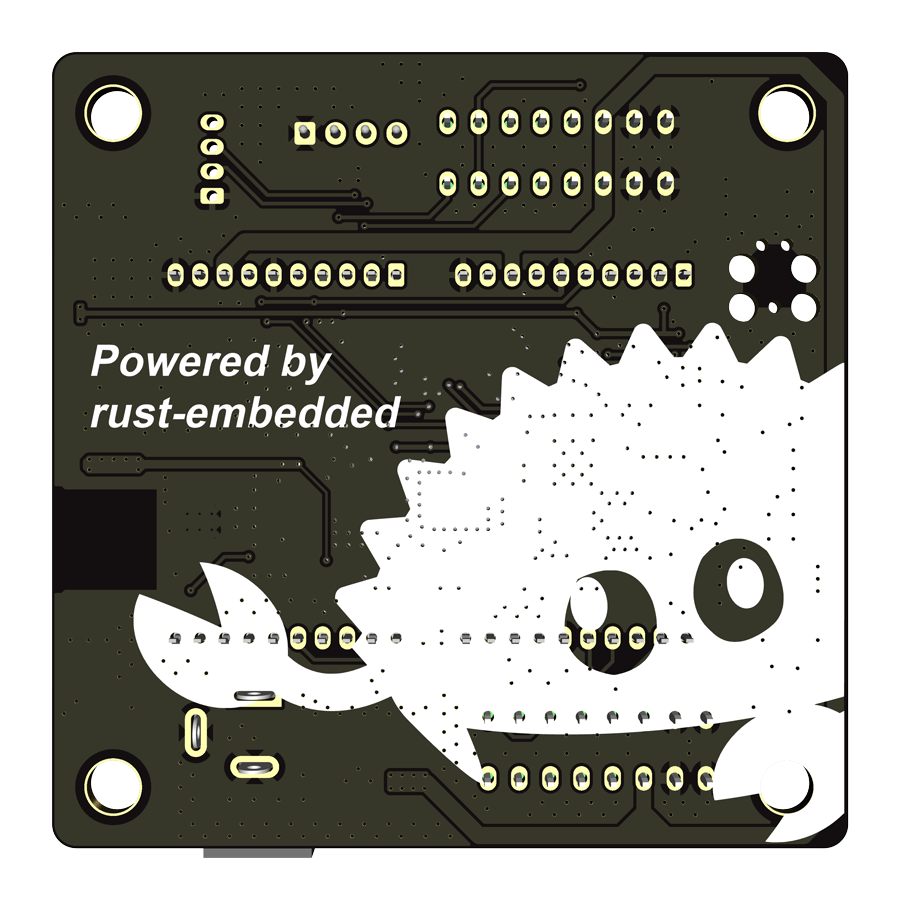

<!--
SPDX-FileCopyrightText: © 2023 Jinwoo Park (pmnxis@gmail.com)

SPDX-License-Identifier: MIT OR Apache-2.0
-->

# Hardware 

| 앞면 사진 | 뒷면 사진 |
| ---- | ---- |
|  |  | 

## 제품 사양

|             |              |
| ----------- | ------------ |
| Product name| BillMock     |
| Manufacturer| GPARK Co., Ltd. |
| Country     | South Korea |
| Dimension   | 65.0 mm * 65.0 mm |
| MCU         | STM32G030C8 |
| MCU Spec    | ARM Cortex-M0+ 64Mhz CPU, 8KiB SRAM, 64KiB Flash |
| Software    | Embassy-rs written in rust |
| Power Input | 12V 2A |
| Pouwer Output | 5V (Peak 2.2A 300mS trip, 1.1A nominal MAX) - Credit card reader power |

※ 입력전원은 16V까지 사용이 가능하나 지폐기쪽 전원과 그대로 반영이 되므로, 주의가 필요

## Hardware design
BillMock hardware schematic repository (only pdf) : [BillMock Hardware PDF Release](https://github.com/pmnxis/BillMock-HW-RELEASE)

PDF로 인쇄된 회로도는 CC BY-SA 3.0 하에 배포되지만 실제 Gerber 파일 및 프로젝트 파일은 비공개 상태입니다.

#### v 0.2 (2023-06-13)
[BillMock-HW-0v2.pdf](https://github.com/pmnxis/BillMock-HW-RELEASE/blob/master/sch/BillMock-HW-0v2.pdf)

#### v 0.3 (2023-08-11)
[BillMock-HW-0v3.pdf](https://github.com/pmnxis/BillMock-HW-RELEASE/blob/master/sch/BillMock-HW-0v3.pdf)

#### v 0.4 (2023-08-30)
[BillMock-HW-0v4.pdf](https://github.com/pmnxis/BillMock-HW-RELEASE/blob/master/sch/BillMock-HW-0v4.pdf)
