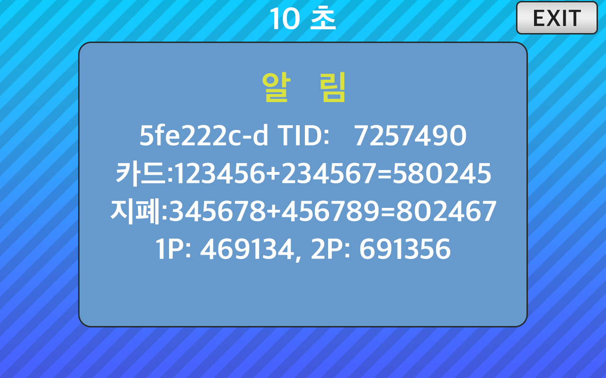

<!--
SPDX-FileCopyrightText: © 2023 Jinwoo Park (pmnxis@gmail.com)

SPDX-License-Identifier: MIT OR Apache-2.0
-->

# DIP Switch

 

## Overview

| **SW #** | **SW Name** | 설명 |
| :-------: | -----------| --------- |
| `1`       | `INHIBIT0` | Inhibit Override(입수금지 강제 설정) - Player 1 |
| `2`       | `INHIBIT1` | Inhibit Override(입수금지 강제 설정) - Player 2 |
| `3`       | `TIMING0`  | Timing Override(펄스폭 강제 설정) (50 ms Std) |
| `4`       | `TIMING1`  | Timing Override(펄스폭 강제 설정) (100 ms Std) |
| `5`       | `MODE0`    | Application mode(실행 모드) |
| `6`       | `MODE1`    | Application mode(실행 모드) |

## 입수금지 강제 설정 - Inhibit override

| Inhibit0 (`1`) | Inhibit1P (`2`) | 설정                   |
| :-------------: | :--------------: | ------------------------------- |
| `0`             | `0`              | 일반 (강제 입수금지 없음)        |
| `1`             | `0`              | 1P에 대한 강제 입수금지 설정     |
| `0`             | `1`              | 2P에 대한 강제 입수금지 설정     |
| `1`             | `1`              | 전체적인 강제 비활성화 설정     |

- 딥 스위치 설정에 따라 각 플레이어에 대한 강제 입수금지하여 게임 I/O 신호와 관계없이 입수금지 상태로 설정됩니다.
- 딥 스위치 설정에서 강제 입수금지가 없더라도 호스트 게임 I/O 측에서 비활성화가 활성화된 경우 각 플레이어에 대한 입수금지가 활성화됩니다.
- 이 Inhibit DIP 스위치 설정은 현장 엔지니어가 유지 보수 중인 장치의 입수금지하는 데 사용할 수 있습니다.

## 신호 폭 강제 설정 - Timing override

| TIMING0 (`3`) | TIMING1 (`4`) | 구성 |
| :-----------: | :-----------: | ----------------------------- |
| `0` | `0` | 자동 |
| `1` | `0` | 50mS Active Low 강제 설정 |
| `0` | `1` | 100mS Active Low 강제 설정
| `1` | `1` | 200mS Active Low 강제 설정

- 타이밍 SW `00`(자동), Active Low 출력 신호용,
 시리얼 통신에서 제공하는 펄스 지속 시간 또는
 병렬 통신(기존 동전 및 지폐 수용기)의 펄스 지속 시간 측정값을
 을 신호 소스에 따라 별도로 설정합니다.
 둘 다 사용할 수 없는 경우 기본값(100mS)이 사용됩니다.

- 타이밍 SW `01`, `10`, `11`은 모든 신호 소스의 펄스 지속 시간을 무시하고
 50mS, 100mS, 200mS 중 하나로 고정하여 출력합니다.

## 실행모드 - Application mode

| MODE0 (`5`) | MODE1 (`6`) | 스왑 상태  | 특수 기능                                             |
| :---------: | :---------: | ------------ | ----------------------------------------------------- |
| `0`         |  `0`        | 스타트 신호 | 아니오, 스타트 신호는 호스트(게임 PCB) 측 출력으로 바이패스됨 |
| `1`         |  `0`        | 스타트 신호 | 예, 스타트 신호는 시리얼 통신을 통한 결제 수입의 방향을 결정합니다 |
| `0`         |  `1`        | JAM 신호     | 아니오, JAM 신호는 JAM(게임 PCB) 측 출력으로 바이패스됨    |
| `1`         |  `1`        | 사용 불가     | ROM 내용 표시, 이외 동작 정지                                              |

- MODE0 (5) : 특수 기능을 비활성화하거나 활성화합니다.
- MODE1 (6) : Vend 쪽에서 `start`와 `jam` 입력 신호를 스왑합니다. 기본 정의는 스타트입니다.

- `00` : BypassStart
    > 일반 모드로 시작을 바이패스합니다 (기본 값). 스타트 신호는 호스트(게임 PCB) 측 출력으로 바이패스됩니다.

- `01` : StartButtonDecideSerialToVend
    > 스타트 버튼을 모방하는 특수 모드입니다.
    > 스타트 신호는 시리얼 통신을 통한 결제 수입의 방향을 결정합니다.

- `10` : BypassJam
    > JAM을 바이패스하는 일반 모드 (논리적으로 스왑). JAM 신호는 호스트(게임 PCB) 측 출력으로 바이패스됩니다.

- `11` : DisplayRom
    > 
    > - BillMock의 펌웨어 정보와 카드 단말기 TID, 누계된 카드, 지폐(동전) 계수를 표시하며 코인미터기를 대신해서 쓸 수 있습니다.
    > - 연결된 카드단말기의 TID가 변경되면, 누계 카드 계수는 0으로 초기화 됩니다.
    > 자세한 정보는 [DisplayRom 상세 정보](./feature_disp_rom.md) 를 참고해주십시오.
