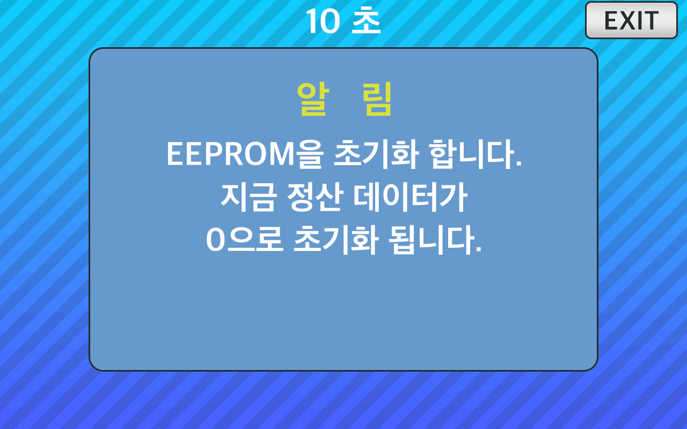

<!--
SPDX-FileCopyrightText: © 2023 Jinwoo Park (pmnxis@gmail.com)

SPDX-License-Identifier: MIT OR Apache-2.0
-->

# Counter Reset

- 경고문은 10초 동안 뜨며, 경고문이 뜬 시점에 이미 ROM내용은 초기화 됩니다.

- [DispRom](./feature_disp_rom.md) 에서 표시되는 `P1 Card`, `P2 Card`, `P1 Coin`, `P2 Coin` 의 카운트가 0으로 초기화 되며 부팅횟수, 사용시간 등의 정보는 초기화 되지 않습니다.

- 해당 기능은 `0.3.1` 펌웨어, 하드웨어 `0.5` 혹은 `Mini 0.5` 이상의 하드웨어에 있는 SVC버턴을 10초 이상 눌러야 사용할수 있습니다.
  > 
