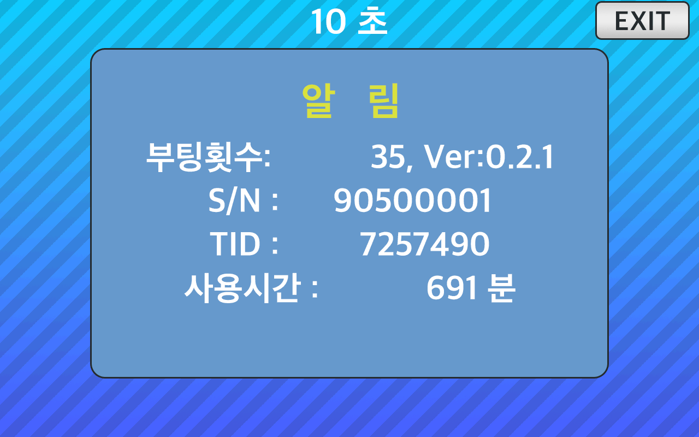
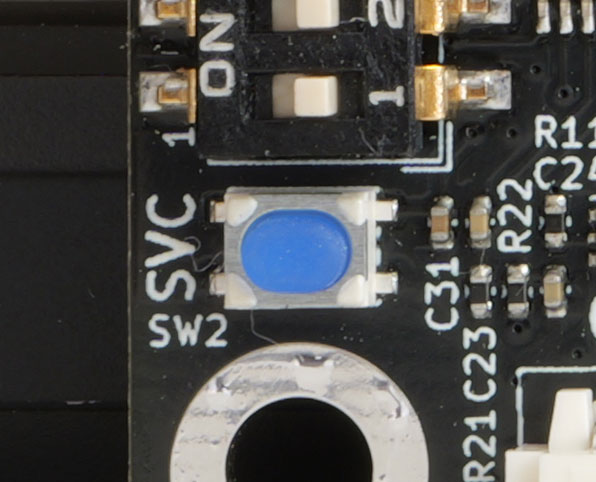

<!--
SPDX-FileCopyrightText: © 2023 Jinwoo Park (pmnxis@gmail.com)

SPDX-License-Identifier: MIT OR Apache-2.0
-->

# DisplayHwInfo

- 통상 운용중에 위와 같은 정보를 보기위해서는 DIP SWITCH상에서 [DIP-SWITCH 실행모드](./dip_switch.md#실행모드---application-mode)를 확인하여 설정해주십시오.

- 정보는 10초동안 뜨며, 4줄에 나눠서 ROM과 프로그램에 대한 내용이 게시된다.
    - 1줄 : `{Boot Cnt}   버젼:{x.y.z}`
        - **Boot Cnt** : BillMock 하드웨어의 부팅 횟수 입니다. 기기가 꺼졌다가 다시 켜질떄마다 1씩 올라갑니다.
        - **x.y.z** : BillMock 펌웨어 프로그램 [billmock-app-rs](https://github.com/pmnxis/billmock-app-rs) 의 펌웨어 버젼입니다. 

    - 2줄 : `S/N : {Serial Number}`
        - **Serial Number** : BillMock 하드웨어의 고유 시리얼 넘버입니다. 양산 출하시 부여됩니다.

    - 3줄 : `TID : {TID}`
        - **TID** : 카드 단말기의 고유번호입니다. PG사에 단말기 연결을 할때 카드단말기에서 설정이 되는 값이며, PG사의 전산에서도 확인이 가능한 고유번호입니다.

    - 4줄 : `사용시간 : {Uptime} 분`
        - **Uptime** : BillMock 하드웨어가 켜진시간을 나타냅니다. 분단위로 표시가 됩니다.

- 해당 기능은 `0.2.1` 펌웨어, 하드웨어 `0.4` 혹은 `Mini 0.4` 이상부터 사용할 수 있으며, 전에 있는 하드웨어 에서는 사용할 수 없습니다.

- 하드웨어 `0.5` 혹은 `Mini 0.5` 이상의 하드웨어에 있는 SVC버턴을 2초 정도 누름으로서 사용할수 있습니다.
  > 

- 하드웨어 `0.4` 혹은 `Mini 0.4` 이상의 하드웨어에서 DIP 스위치를 통해 [DispRom](./feature_disp_rom.md) 를 빠져나올 때도 표시가 됩니다.
