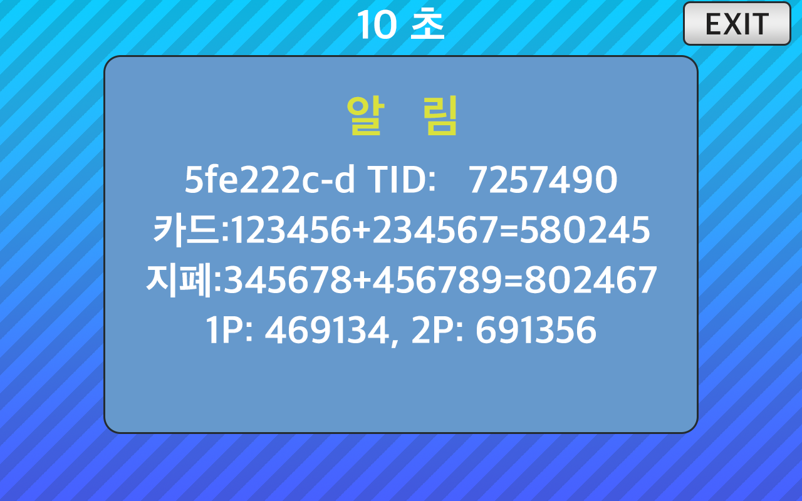

<!--
SPDX-FileCopyrightText: © 2023 Jinwoo Park (pmnxis@gmail.com)

SPDX-License-Identifier: MIT OR Apache-2.0
-->

# DisplayRom

- 통상 운용중에 위와 같은 정보를 보기위해서는 DIP SWITCH상에서 [DIP-SWITCH 실행모드](./dip_switch.md#실행모드---application-mode)를 확인하여 설정해주십시오.

- 정보는 10초동안 뜨며, 4줄에 나눠서 ROM과 프로그램에 대한 내용이 게시된다.
    - 1줄 : `{Git Hash}   {TID}`
        - **Git Hash** : BillMock 펌웨어 프로그램 [billmock-app-rs](https://github.com/pmnxis/billmock-app-rs) 의 shorten git commit hash입니다.
        - **TID** : 카드 단말기의 고유번호입니다. PG사에 단말기 연결을 할때 카드단말기에서 설정이 되는 값이며, PG사의 전산에서도 확인이 가능한 고유번호입니다.

    - 2줄 : `카드 : {1P Count} + {2P Count} = {Credit Sum}`
        - **1P Count** : 카드단말기에 사전에 설정된 클럭 수와 소비자가 결제한 내역을 바탕으로 누계된 플레이어 **1**에 대한 클럭 수 
        - **2P Count** : 카드단말기에 사전에 설정된 클럭 수와 소비자가 결제한 내역을 바탕으로 누계된 플레이어 **2**에 대한 클럭 수
        - **Credit Sum** : 카드 단말기로 결제된 1P Count와 2P Count 값의 합계

    - 3줄 : `지폐 : {1P Count} + {2P Count} = {Coin Sum}`
        - **1P Count** : 지폐기 혹은 코인기 클럭 수와 소비자가 지불한 내역을 바탕으로 누계된 플레이어 **1**에 대한 클럭 수 
        - **2P Count** : 지폐기 혹은 코인기 클럭 수와 소비자가 지불한 내역을 바탕으로 누계된 플레이어 **2**에 대한 클럭 수
        - **Coin Sum** : 지폐기 혹은 코인기로 지불된 1P Count와 2P Count 값의 합계

    - 4줄 : `1P : {1P Sum Count}, {2P Sum Count}`
        - **1P Sum Count** : 카드단말기 와 지폐기(혹은 코인기)로 누계된 플레이어 **1**에 대해 합산된 클럭 수 _2번째와 3번째 줄의 1P Count 의 합계_
        - **2P Sum Count** : 카드단말기 와 지폐기(혹은 코인기)로 누계된 플레이어 **2**에 대해 합산된 클럭 수 _2번째와 3번째 줄의 2P Count 의 합계_

- 모든 카운트 숫자는 6자리 (0 ~ 999,999) 까지 표시된다. 1,000,000이 넘어가면 0이 아닌 000,000으로 표시되며 그다음 1,000,001은 000,001 로 표시된다.

- 해당 기능은 `0.2.0` 펌웨어, 하드웨어 `0.4` 혹은 `Mini 0.4` 이상부터 사용할 수 있으며, 전에 있는 하드웨어 에서는 사용할 수 없습니다.
