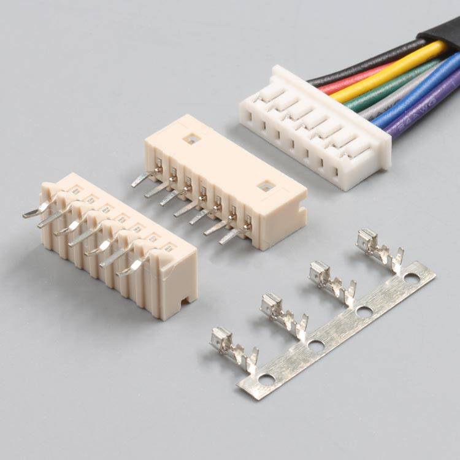
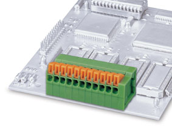

<!--
SPDX-FileCopyrightText: © 2023 Jinwoo Park (pmnxis@gmail.com)

SPDX-License-Identifier: MIT OR Apache-2.0
-->

# 기기 설치
실제 오락실 기기에 연결할때 두가지 형태로 설치할 수 있습니다.

각자 장단점이 있으니 둘 다 테스트 후 적합한 방법을 선택해주세요.

## 전용 단자 제작-
<!--### 전용 단자 제작-->

  1. 핀 아웃 목차(포트 설명) 에서 사용할 하네스를 마련합니다.
  2. 연결합니다.

## Cut previous harness and connect to terminal
<!--### 기존 하네스에 터미널 단자 사용-->

  1. 선길이가 어느정도 여유가 있다는 가정하에, 본 제품을 설치할 지점에서 선을 자릅니다.
  2. 자른 선의 양쪽에 1cm (10 mm) 정도 도선이 보이는 상태로 피복을 벗깁니다.
  3. 상/하단의 터미널에 주황색 걸쇠를 누른채로 구멍에 아까 벗긴 도선을 튼튼하게 넣어줍니다.
  
 - ※ 대체로 상단에 실제 화폐지불장치로 가는 배선이 연결되어야 하며, 하단쪽에는 GAME I/O PCB쪽으로 나가는 배선이 연결 됩니다.
 - ※ 기존 배선을 활용하는 것이기에 길이 여유가 어느정도 있어야합니다.
 - ※ 기존 배선은 UL/CUL 규격 기준 AWG20 이상, AWG26 이하의 배선만 해당 터미널에 사용 가능합니다.
