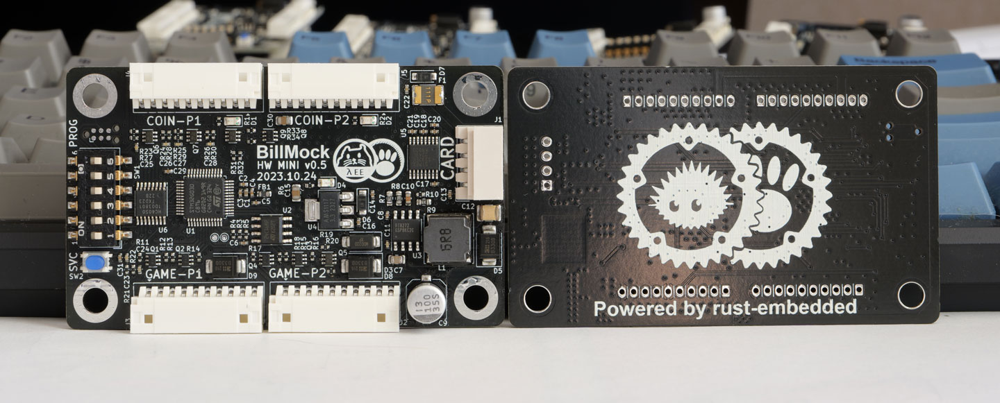
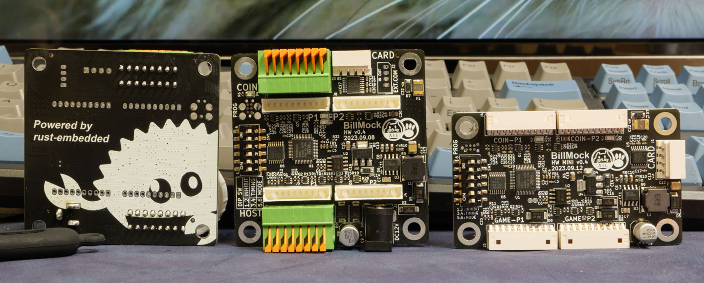

<!--
SPDX-FileCopyrightText: © 2023 Jinwoo Park (pmnxis@gmail.com)

SPDX-License-Identifier: MIT OR Apache-2.0
-->

# 둘러보기

<a style="font-weight:bold" href="https://billmock.pmnxis.net">English Manual</a> is here 

"Billmock"은 주로 대한민국의 오락실 기계에서 사용되며, 화폐 지불 입력 신호를 특정 조건에 따라 조작하기 위해 개발된 시스템입니다. 이 시스템은 주로 카드 단말기를 설치하거나 신호 대기열에 따른 순차 작업과 같이 다양한 조건에 기반한 프로그래밍 작업이 필요한 경우에 사용됩니다.

현장에서 원하는 설정으로 쓰기위해 미리 설정된 I/O 리매핑을 DIP-Switch로 설정할 수 있으며, wire-map상으로는 HOST GAME PCB 와 지폐기기 사이에 설치가 됩니다. 

## 하드웨어

최종 양산으로 채택하고 있는 Hardware revision은 0.5-MINI 이며, 프로그램 개발또한 해당 버젼에 맡게 진행 되고 있습니다.

이전에 개발된 하드웨어로는 0.2, 0.3, 0.4, 0.4-Mini 총 4가지의 Hardware revision이 있으며 이전 버젼중 추가로 사용 가능한 것은 0.4 와 0.4 Mini이 사용가능 합니다. (일부 SVC관련된 기능을 사용할 수 없음)

핀맵이나 설치를 확인하기 위해서는 좌측의 목차에서 원하는 항목을 확인하십시오.

## For Developer
이 프로젝트는 일부 NDA 영역과 양산에 필요한 데이터를 제외하고는 오픈소스 공개를 전제로 하고 개발됬습니다. 

개발에 관련된 부분은 [개발자 매뉴얼](dev_manual.md) 를 참고해주십시오.

## 라이센스
이 프로그램과 관련 자료는 Apache Software License 2.0의 조건에 따라 사용할 수 있으며, 이 조건은 Apache Software License 2.0에서 확인할 수 있습니다. 또한, MIT 라이선스에 따라 사용할 수도 있으며, 이 조건은 MIT License에서 확인할 수 있습니다.

또한, 모든 코드는 MIT 또는 Apache Software License 2.0에 기반하고 있습니다. 그러나 일부 공통적인 *.toml 파일은 CC0-1.0 라이선스를 기반으로 하고 있습니다.

다만 공장 출하되는 펌웨어는 일부 NDA코드가 포함되어 있으며, 이 경우에는 위에서 언급한 라이센스의 영향을 받지않는 비공개 소프트웨어 라이센스를 기반으로 하고있습니다.

공개된 범위의 회로도(PDF)는 CC-BY-SA 3.0으로 배포가되며, 변형되거나 참고시 저작자표시 및 동일조건으로만 배포 가능합니다.
