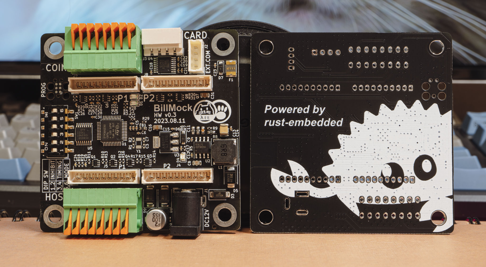

<!--
SPDX-FileCopyrightText: © 2023 Jinwoo Park (pmnxis@gmail.com)

SPDX-License-Identifier: MIT OR Apache-2.0
-->

# 둘러보기

<a style="font-weight:bold" href="https://billmock.pmnxis.net">English Manual</a> is here 

"Billmock"은 주로 대한민국의 오락실 기계에서 사용되며, 화폐 지불 입력 신호를 특정 조건에 따라 조작하기 위해 개발된 시스템입니다. 이 시스템은 주로 카드 단말기를 설치하거나 신호 대기열에 따른 순차 작업과 같이 다양한 조건에 기반한 프로그래밍 작업이 필요한 경우에 사용됩니다.

현장에서 원하는 설정으로 쓰기위해 미리 설정된 I/O 리매핑을 DIP-Switch로 설정할 수 있으며, wire-map상으로는 HOST GAME PCB 와 지폐기기 사이에 설치가 됩니다. 

## 하드웨어

현재까지 0.2, 0.3, 0.4 총 3가지의 Hardware revision이 있으며 실제로 사용 가능한 것은 0.3, 0.4 에 맞춰서 개발되고 있습니다.

자세한 HW schematic은 [BillMock-HW-RELEASE](https://github.com/pmnxis/BillMock-HW-RELEASE) 에서 확인이 가능합니다.

## 펌웨어 프로그램
Firmware software는 defacto로 쓰이던 `C` 언어가 아닌 Rust로 개발되었습니다. Rust를 신뢰해서 쓴 것도 있지만 Rust 로 mass production을 위한 embedded system에 적용이 가능 하다는 것을 검증하기위한 용도 또한 있습니다. 따라서 firmware source가 하나의 example-code 선례로서 남기를 바랍니다.

## 라이센스
이 프로그램과 관련 자료는 Apache Software License 2.0의 조건에 따라 사용할 수 있으며, 이 조건은 Apache Software License 2.0에서 확인할 수 있습니다. 또한, MIT 라이선스에 따라 사용할 수도 있으며, 이 조건은 MIT License에서 확인할 수 있습니다.

또한, 모든 코드는 MIT 또는 Apache Software License 2.0에 기반하고 있습니다. 그러나 일부 공통적인 *.toml 파일은 CC0-1.0 라이선스를 기반으로 하고 있습니다. (예: Cargo.toml)

다만 공장 출하되는 펌웨어는 일부 NDA코드가 포함되어 있으며, 이 경우에는 위에서 언급한 라이센스의 영향을 받지않는 비공개 소프트웨어 라이센스를 기반으로 하고있습니다.