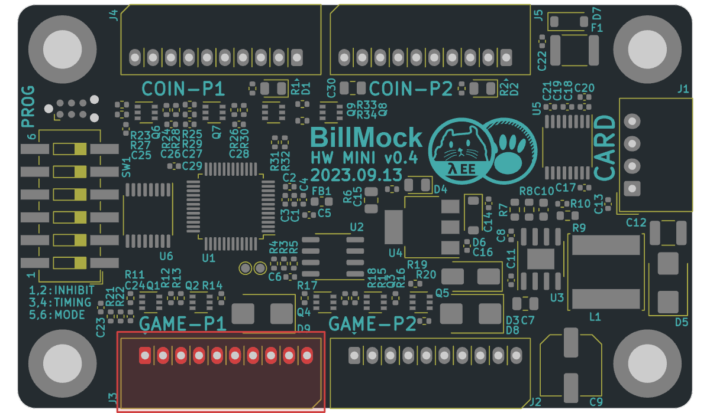
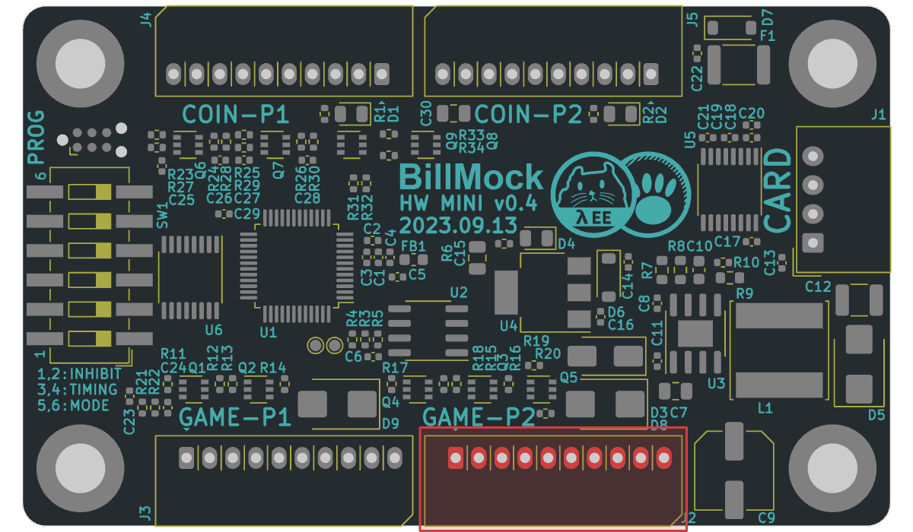

<!--
SPDX-FileCopyrightText: © 2023 Jinwoo Park (pmnxis@gmail.com)

SPDX-License-Identifier: MIT OR Apache-2.0
-->

# Host side 핀 아웃

## Host Side Player 1 Port (좌측)

|                |                |
| -------------- | -------------- |
| Designator     | J3  |
|                | 가상 1P 코인기/지폐기/스타트 포트 |
| Connector      | 141R-2.54-8P |

| **Pin #** | **Pin Name** | 설명 |
| :-------: | -------------| --------- |
| `1`       | `V1-BUSY`    | 가상1P 코인기/지폐기 BUSY신호 <U>에뮬레이션</U> 출력  |
| `2`       | `V1-VEND`    | 가상1P 코인기/지폐기 진권신호 <U>에뮬레이션</U> 출력 신호 |
| `3`       | `V1-JAM`     | 가상1P 코인기/지폐기 종이걸림/고장 <U>에뮬레이션</U> 입력 신호 |
| `4`       | `V1-START`   | 가상1P 스타트 버튼쪽 스위치 <U>에뮬레이션</U> 출력 신호 |
| `5`       | `V1-INHIBIT` | 가상1P 코인기/지폐기 입수금지 <U>에뮬레이션</U> 입력 신호 |
| `6`       | N/C    |  |
| `7`       | N/C    |  |
| `8`       | `12V`  |  +극 전원 입력/출력, 제품 +극 전원 (12V 권장) |
| `9`       | `12V`  |  +극 전원 입력/출력, 제품 +극 전원 (12V 권장) |
| `10`      | `GND`  |  -극 전원 입력/출력. 제품 -극 전원 |

- Pin# 오른쪽 부터 카운트함
- `12V`, `GND`로 BillMock-HW 자체의 전원을 입력받을 수 도 있습니다.
- 이 포트에서 나오는 전원 핀은 전원 출력용으로 사용 할 수 없습니다. 해당 포트로 들어오는 전원 입력이 차단 되는 경우, 역 전압이 흐르지 않습니다.
- Credit card의 payment 신호를 받거나 VEND  입력 신호가  Active Low로 들어온 시점부터 VEND 출력 신호가 Toggle 신호가 끝날 때 까지 Busy 출력신호를 Active Low로 출력합니다.

------------

## Host Side Player 2 Port 우측

|                |                |
| -------------- | -------------- |
| Designator     | J2  |
|                | 가상 2P 코인기/지폐기/스타트 포트 |
| Connector      | 141R-2.54-8P |

| **Pin #** | **Pin Name** | 설명 |
| :-------: | -------------| --------- |
| `1`       | `V1-BUSY`    | 가상2P 코인기/지폐기 BUSY신호 <U>에뮬레이션</U> 출력  |
| `2`       | `V1-VEND`    | 가상2P 코인기/지폐기 진권신호 <U>에뮬레이션</U> 출력 신호 |
| `3`       | `V1-JAM`     | 가상2P 코인기/지폐기 종이걸림/고장 <U>에뮬레이션</U> 입력 신호 |
| `4`       | `V1-START`   | 가상2P 스타트 버튼쪽 스위치 <U>에뮬레이션</U> 출력 신호 |
| `5`       | `V1-INHIBIT` | 가상2P 코인기/지폐기 입수금지 <U>에뮬레이션</U> 입력 신호 |
| `6`       | N/C    |  |
| `7`       | N/C    |  |
| `8`       | `12V`  |  +극 전원 입력/출력, 제품 +극 전원 (12V 권장) |
| `9`       | `12V`  |  +극 전원 입력/출력, 제품 +극 전원 (12V 권장) |
| `10`      | `GND`  |  -극 전원 입력/출력. 제품 -극 전원 |

- Pin# 오른쪽 부터 카운트함
- `12V`, `GND`로 BillMock-HW 자체의 전원을 입력받을 수 도 있습니다.
- 이 포트에서 나오는 전원 핀은 전원 출력용으로 사용 할 수 없습니다. 해당 포트로 들어오는 전원 입력이 차단 되는 경우, 역 전압이 흐르지 않습니다.
- Credit card의 payment 신호를 받거나 VEND  입력 신호가  Active Low로 들어온 시점부터 VEND 출력 신호가 Toggle 신호가 끝날 때 까지 Busy 출력신호를 Active Low로 출력합니다.
