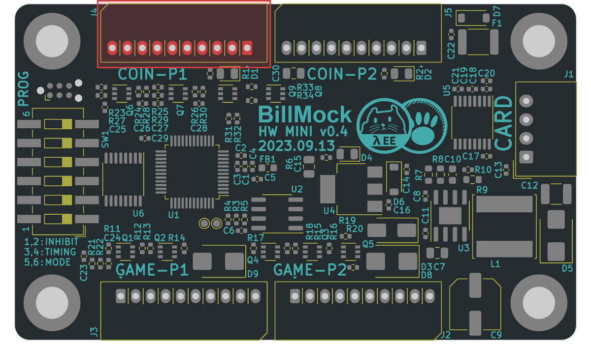
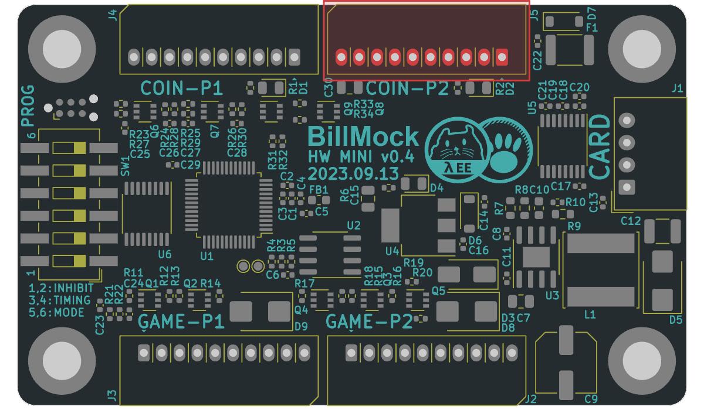

<!--
SPDX-FileCopyrightText: © 2023 Jinwoo Park (pmnxis@gmail.com)

SPDX-License-Identifier: MIT OR Apache-2.0
-->

# Vend side port map

## Vend Side Player 1 Port (좌측)

|                |                |
| -------------- | -------------- |
| Designator     | J4  |
|                | Player 1 - 실존하는 코인기 / 지폐기 포트 |
| Connector      | Molex 53014-10xx |
| Housing        | Molex 51004-10xx |
| Crimp          | Molex 50011 |

| **Pin #** | **Pin Name**   | 설명 |
| :-------: | -------------- | --------- |
| `1`       | N/C    |  |
| `2`       | `VEND` | 코인기/지폐기 진권 입력 신호 |
| `3`       | N/C    |  |
| `4`       | `START`| 스타트 버튼 입력 신호 |
| `5`       | `INHIBIT`| 코인기/지폐기 입수금지(비활성화) 출력 신호 |
| `6`       | `GND`  |  코인기/지폐기 -극 전원 입력/출력. 제품 -극 전원 |
| `7`       | N/C    |  |
| `8`       | `12V`  |  코인기/지폐기 +극 전원 입력/출력, 제품 +극 전원 |
| `9`       | `12V`  |  코인기/지폐기 +극 전원 입력/출력, 제품 +극 전원 |
| `10`      | `GND`  |  코인기/지폐기 -극 전원 입력/출력. 제품 -극 전원 |

- Pin# 왼쪽 부터 카운트함
- `12V`, `GND`로 BillMock-HW 자체의 전원을 입력받을 수 도 있습니다.

------------

## Vend Side Player 2 Port 우측

|                |                |
| -------------- | -------------- |
| Designator     | J5  |
|                | Player 2 - 실존하는 코인기 / 지폐기 포트 |
| Connector      | Molex 53014-10xx |
| Housing        | Molex 51004-10xx |
| Crimp          | Molex 50011 |

| **Pin #** | **Pin Name**   | 설명 |
| :-------: | -------------- | --------- |
| `1`       | N/C    |  |
| `2`       | `VEND` | 코인기/지폐기 진권 입력 신호 |
| `3`       | N/C    |  |
| `4`       | `START`| 스타트 버튼 입력 신호 |
| `5`       | `INHIBIT`| 코인기/지폐기 입수금지(비활성화) 출력 신호 |
| `6`       | `GND`  |  코인기/지폐기 -극 전원 입력/출력. 제품 -극 전원 |
| `7`       | N/C    |  |
| `8`       | `12V`  |  코인기/지폐기 +극 전원 입력/출력, 제품 +극 전원 |
| `9`       | `12V`  |  코인기/지폐기 +극 전원 입력/출력, 제품 +극 전원 |
| `10`      | `GND`  |  코인기/지폐기 -극 전원 입력/출력. 제품 -극 전원 |

- Pin# 왼쪽 부터 카운트함
- `12V`, `GND`로 BillMock-HW 자체의 전원을 입력받을 수 도 있습니다.