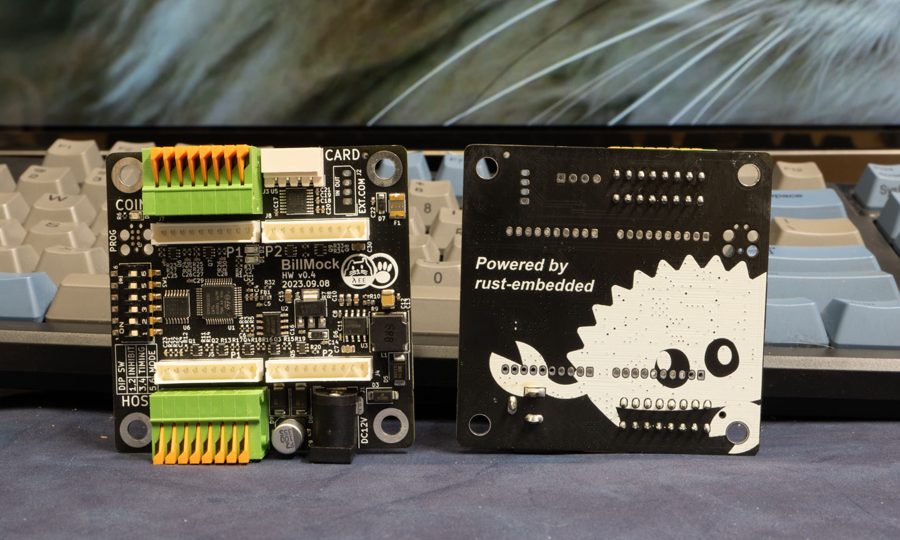
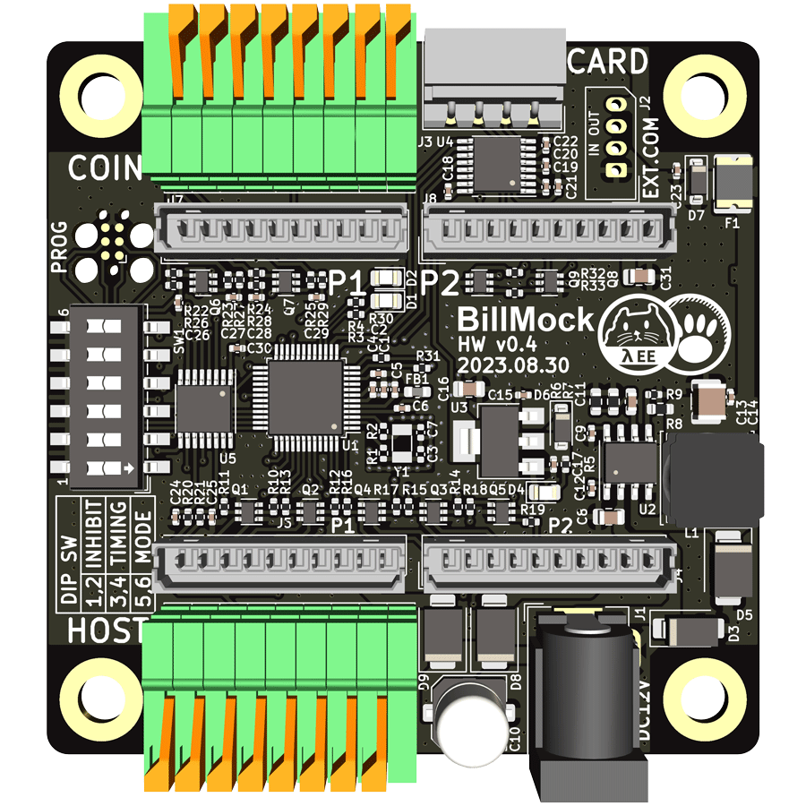
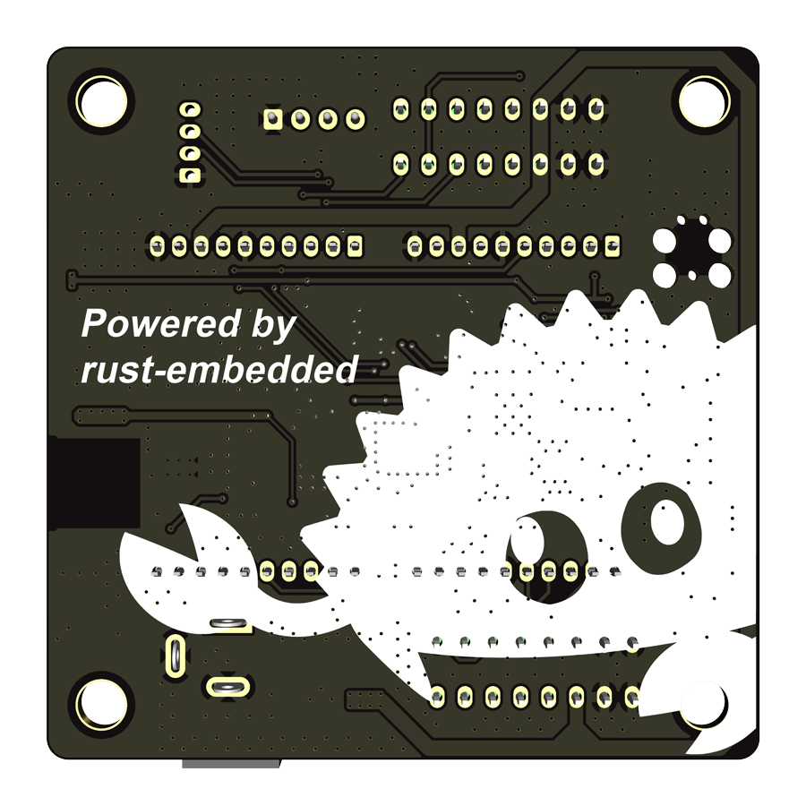
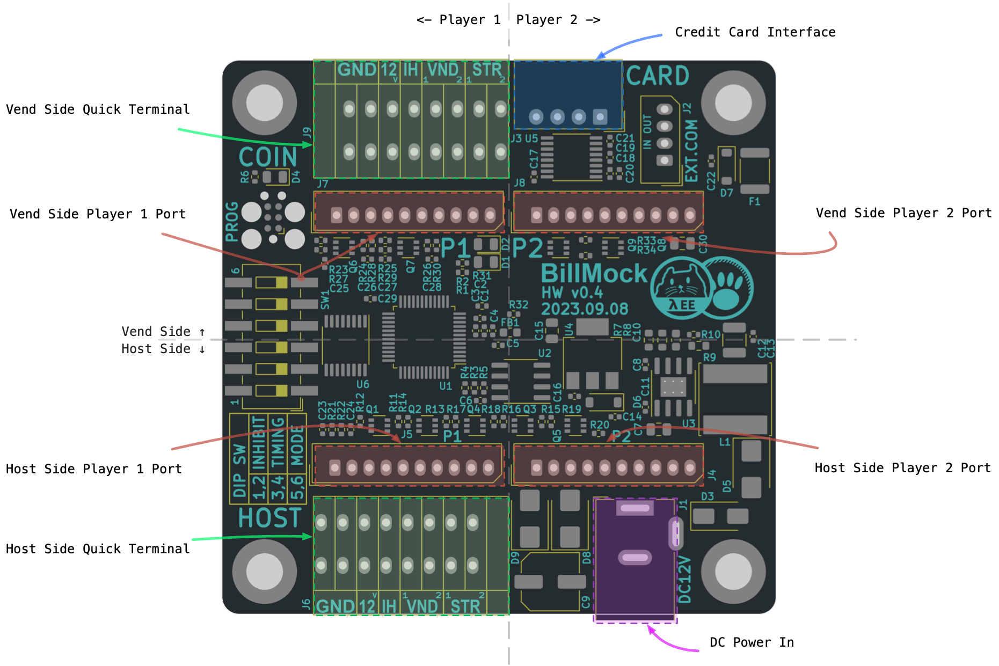
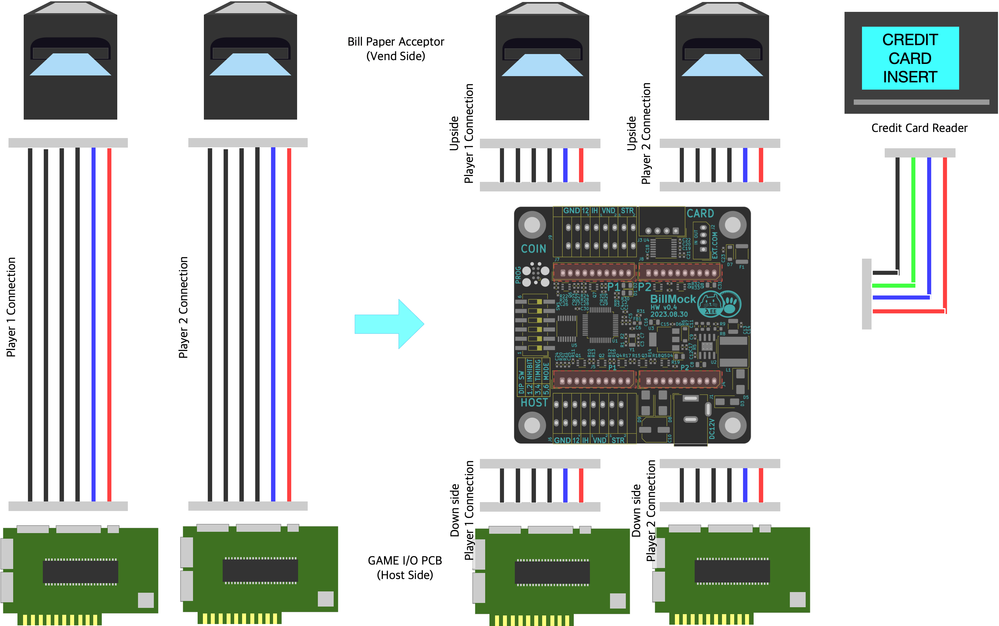

<!--
SPDX-FileCopyrightText: © 2023 Jinwoo Park (pmnxis@gmail.com)

SPDX-License-Identifier: MIT OR Apache-2.0
-->

# BillMock

| 앞면 사진 | 뒷면 사진 |
| ---- | ---- |
|  |  | 

## 핀아웃 둘러보기

상단에는 Vend Side(진권에 관련된 지폐기, 동전기, 카드단말기 등) 커넥터가 배치되어 있으며,

하단에는 Host Side(GAME I/O PCB 와 같은 실제 오락기기 메인보드 인터페이스) 커넥터가 배치되어 있습니다.

좌측과 우측에 데칼코마니 패턴으로 같은 커넥터들이 배치되어있으며, 좌측은 Player 1, 우측은 Player 2를 위한 커넥터가 배치되어 있습니다.

이러한 패턴으로 전반적인 커넥터 구성이 되어있으므로, 실제 설치나 운용시에 참고한다면 쉽게 커넥터에 와이어를 연결할 수 있습니다.

개념적으로 본다면 기존 배선에서는 위에서 아래로 연결된 커넥터가 각각 끊어지고 위쪽의 커넥터와 아래쪽의 커넥터에 연결되고, 그 사이를 하드웨어와 소프트웨어가 관리하는 형태로 동작하며, 이러한 연결을 설계시에 의도 했습니다.

이 외에도 전원 공급을 위한 커넥터, 디버그용 추가 RS232 커넥터, 프로그램 디버깅용 SWD(JTAG) 커넥터가 있습니다. 

## BillMock 의 대략적인 연결

_※ 선의 모양은 임의의 선을 표시하기위한 표식이며, 이미지 상으로 보이는 선색깔로 연결이 되지는 않습니다. 자세한 핀맵은 세부 페이지를 확인 해주세요._

기존에 상단의 지폐기(혹은 코인기) 와 하단의 GAME I/O PCB와의 하네스 연결 사이에 이 PCB (BillMock) 를 설치하는 형태입니다.

경우에 따라서는 추가적인 배선작업이 필요할 수 있습니다만, 국내에서 널리 사용하는 지폐기 배선을 그대로 이용하기에 이를 고려하여 하네스를 준비해 연결하면 됩니다.

BillMock Mini 버젼과 다르게 터미널로 배선 작업을 할 수도 있습니다. 자시한 사항은 [기기 설치](./installation.md) 문서를 확인하십시오.

또한 터미널 핀아웃은 일반 몰렉스 단자와 조금 다르므로, 상단과 하단 터미널에 대해서 이 문서를 확인해주십시오

- [Vend side (상단) 터미널](./port_vend_side.md#vend-side-quick-terminal)
- [Host Side (하단) 터미널](./port_host_side.md#host-side-quick-terminal)

## 제품 사양

|             |              |
| ----------- | ------------ |
| Product name| BillMock     |
| Manufacturer| GPARK Co., Ltd. |
| Country     | South Korea |
| Dimension   | 65.0 mm * 65.0 mm |
| MCU         | STM32G030C8 |
| MCU Spec    | ARM Cortex-M0+ 64Mhz CPU, 8KiB SRAM, 64KiB Flash |
| Software    | Embassy-rs written in rust |
| Power Input | 12V 2A |
| Pouwer Output | 5V (Peak 2.2A 300mS trip, 1.1A nominal MAX) - Credit card reader power |

※ 입력전원은 16V까지 사용이 가능하나 지폐기쪽 전원과 그대로 반영이 되므로, 주의가 필요
