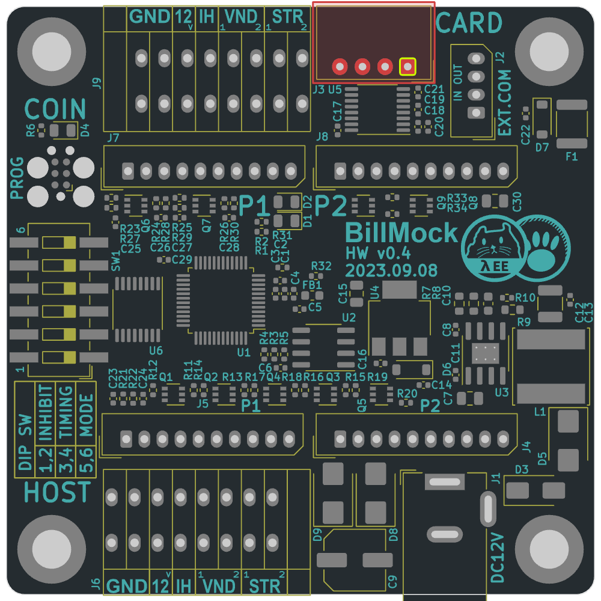
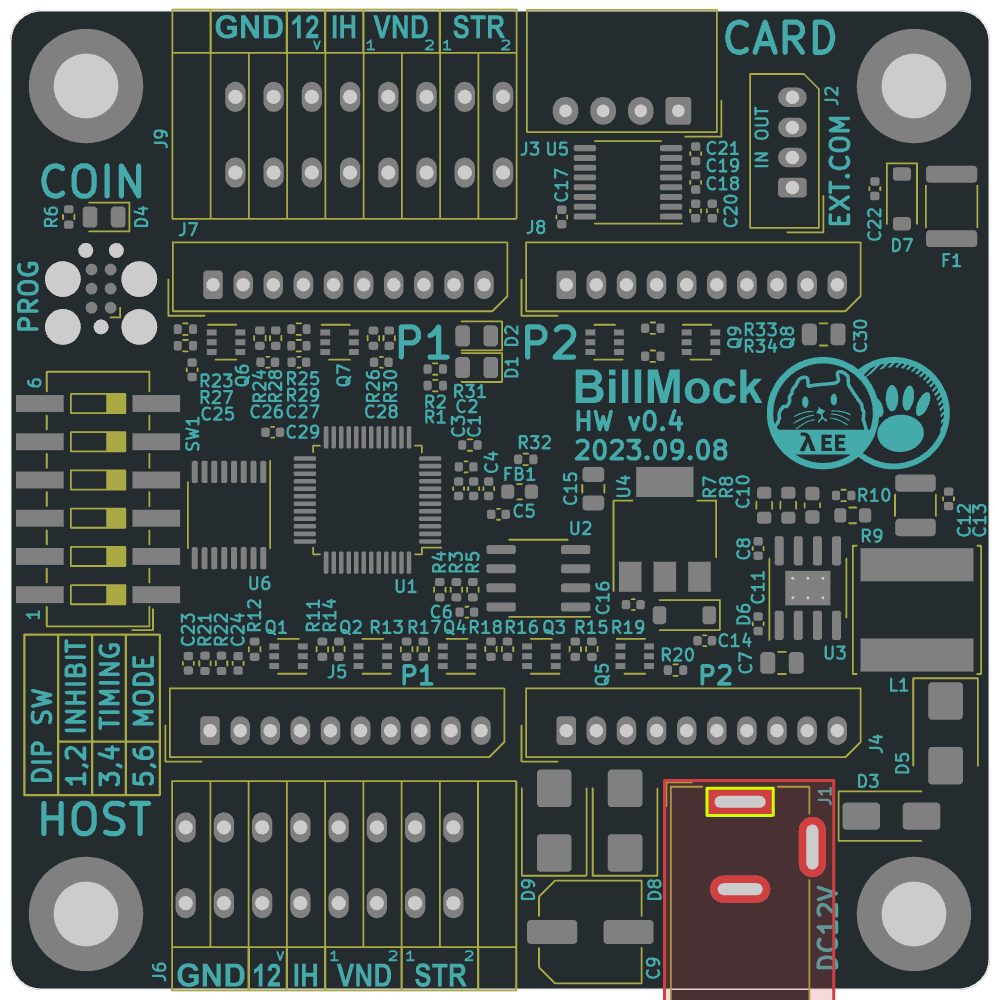
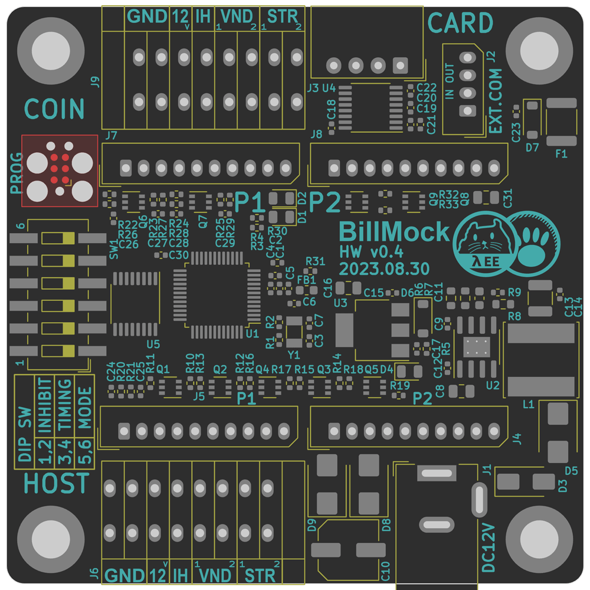

<!--
SPDX-FileCopyrightText: © 2023 Jinwoo Park (pmnxis@gmail.com)

SPDX-License-Identifier: MIT OR Apache-2.0
-->

# Port - ETC

## Credit Card Reader Port

<table>
<tr>
<td>

</td>
<td>

|                |
| -------------- |
|  |
|  |
| **Designator** |
|  J3  |
|  |
|  |
| **Role** |
| Card reader RS232+5V |
|  |
|  |
| **Connector** |
| Molex 5268-04 |
|  |
|  |
| **Housing** |
| Molex 5264-04 |
|  |
|  |
| **Crimp** |
| Molex 5263 |

| **Pin #** | **Pin Name**   | 설명 |
| :-------: | -------------- | --------- |
| `1`       | `GND` |  |
| `2`       | `TXD` | billmock In. |
| `3`       | `RXD` | billmock out. |
| `4`       | `5V`  | 5V Power out |

</td></tr>
</table>

-  5V 출력,  Peak 2.2A 300mS trip, 1.1A nominal MAX.

------------

## DC Power Jack

<table>
<tr>
<td>

</td>
<td>

|                |
| -------------- |
|  |
|  |
| **Designator**     |
|  J1  |
|  |
|  |
| **Role** |
| 별도 DC 전원 잭 |
|  |
|  |
| **Connector**      |
| DC Jack 5.5pi - 2.0pi |

</td></tr>
</table>

- 12V 입력을 권장합니다. (최대 16V)
- 하단 DC 잭 이외에 하단 왼쪽(J5), 하단 오른쪽(J4)의 10핀 몰렉스 포트로 받는 것도 권장합니다.
- 상단 터미널 (J9)/ 상단 10핀 몰렉스(J7/J8)로 전원 입력을 하는 것은 비추천합니다.

------------

### Program debugging (SWD/JTAG)

<table>
<tr>
<td>

</td>
<td>

|                |
| -------------- |
|  |
|  |
| **Role** |
| STM32 SWD |
|  |
|  |
| **Connector** |
| TC2030 |

</td></tr>
</table>

- 디버그 인터페이스에 대해서는 이쪽에서 자세히 확인해주세요. [BillMock-HW-RELEASE](https://github.com/pmnxis/BillMock-HW-RELEASE)
