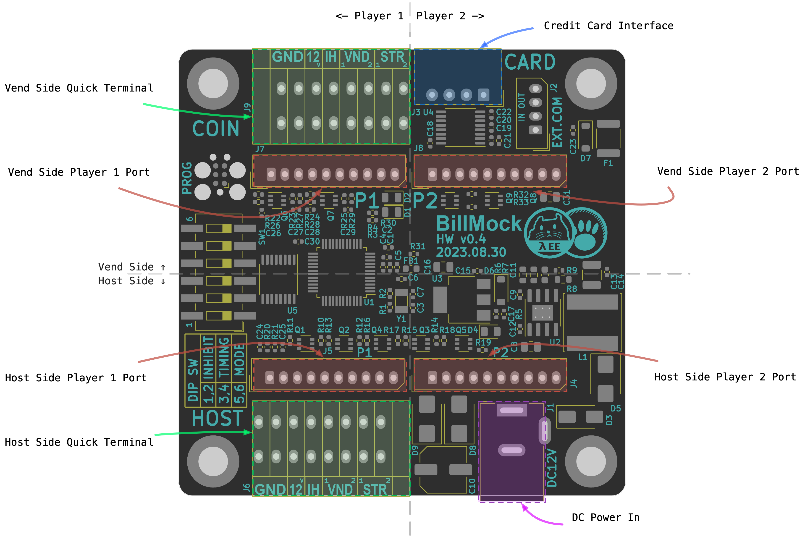

<!--
SPDX-FileCopyrightText: © 2023 Jinwoo Park (pmnxis@gmail.com)

SPDX-License-Identifier: MIT OR Apache-2.0
-->

# Port overview

상단에는 Vend Side(진권에 관련된 지폐기, 동전기, 카드단말기 등) 커넥터가 배치되어 있으며,

하단에는 Host Side(GAME I/O PCB 와 같은 실제 오락기기 메인보드 인터페이스) 커넥터가 배치되어 있습니다.

좌측과 우측에 데칼코마니 패턴으로 같은 커넥터들이 배치되어있으며, 좌측은 Player 1, 우측은 Player 2를 위한 커넥터가 배치되어 있습니다.

이러한 패턴으로 전반적인 커넥터 구성이 되어있으므로, 실제 설치나 운용시에 참고한다면 쉽게 커넥터에 와이어를 연결할 수 있습니다.

개념적으로 본다면 기존 배선에서는 위에서 아래로 연결된 커넥터가 각각 끊어지고 위쪽의 커넥터와 아래쪽의 커넥터에 연결되고, 그 사이를 하드웨어와 소프트웨어가 관리하는 형태로 동작하며, 이러한 연결을 설계시에 의도 했습니다.

이 외에도 전원 공급을 위한 커넥터, 디버그용 추가 RS232 커넥터, 프로그램 디버깅용 SWD(JTAG) 커넥터가 있습니다. 
