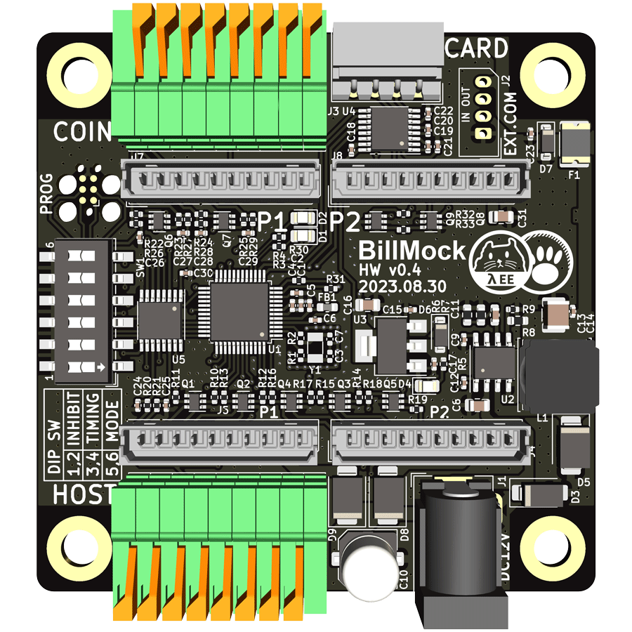

# 하드웨어 차이점 설명

| Mini 버젼 | 일반 버젼 |
| ---- | ---- |
|  |  |

BillMock 하드웨어는 두가지 종류가 있습니다. 직사각형 모양을 한 작은 [BillMock Mini (직사각형)](./port_04_mini_overview.md)과 위아래로 터미널과 DC잭이 있는 정사각형 모양의 [BillMock (정사각형)](./port_04_overview.md) 이 있습니다.

Mini는 일반버젼에서 터미널과 DC잭, 추가 RS232포트를 제거했습니다. 가격이 더 저렴하며, 이미 하네스가 준비된 상태라면 좀 더 수월하게 설치할 수 있으며, 하네스를 구성하기에 매우 복잡하고 현장에서 터미널에 직접 연결을 하는 편이 나은 상황에선 일반버젼이 적합 할 수 있습니다.

하지만 현장에서는 터미널로 매번 구성하는 것 보다 준비된 하네스로 설치를 마치는 것이 효율성이 좋으므로 Mini버젼을 권장 합니다.

## 목차

- [BillMock Mini (직사각형)](./port_04_mini_overview.md)
    - [Vend side (상단)](./port_04_mini_vend_side.md)
    - [Host Side (하단)](./port_04_mini_host_side.md)
    - [기타](./port_04_mini_etc.md)
- [BillMock (정사각형)](./port_04_overview.md)
    - [Vend side (상단)](./port_vend_side.md)
    - [Host Side (하단)](./port_host_side.md)
    - [기타](./port_etc.md)
